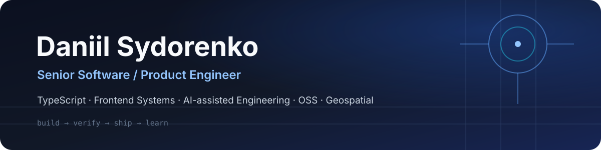

<div align="center">



<br />

[](https://daniilsydorenko.com)
[](https://github.com/DaniilSydorenko)

**TypeScript · Frontend Systems · Product Engineering · AI-assisted Engineering · OSS · Geospatial**

</div>

---

## What I build

I’m a **Senior Software / Product Engineer** with a strong JavaScript/TypeScript and frontend-systems foundation. I work across product architecture, APIs and BFFs, developer tooling, testing, reliability, security, and practical AI-assisted engineering.

I’m especially interested in systems where the hard part is not drawing the UI, but making the whole thing **reliable, understandable, evolvable, and safe to operate**.

<table>
<tr>
<td width="50%" valign="top">

### 🛠 Product engineering

Building real product flows across frontend, backend integration, data, infrastructure, and delivery.

**Current:** Ladvero — AI-assisted marketplace listing workflows with human review and control.

</td>
<td width="50%" valign="top">

### 🧪 Engineering systems

Practicing architecture, reliability, realtime behavior, security, observability, and failure handling through realistic engineering missions.

**Current:** Engineering Labs.

</td>
</tr>
<tr>
<td width="50%" valign="top">

### 🌍 Open source & geospatial

Returning to original OSS work while exploring geospatial systems and products.

**Public:** [Haversine Geolocation](https://github.com/DaniilSydorenko/haversine-geolocation).

</td>
<td width="50%" valign="top">

### 🤖 AI-assisted engineering

Using AI to accelerate research, implementation, review, and automation while keeping engineering judgment and verification explicit.

**Current:** Career Ecosystem and engineering automation.

</td>
</tr>
</table>

## Engineering stack

<p>


</p>

The stack is a toolset, not the story. I care more about **architecture, constraints, verification, trade-offs, and outcomes** than collecting technology logos.

## Selected engineering work

| | Project | Engineering story | Status |
|---|---|---|---|
| 🌍 | **[Haversine Geolocation](https://github.com/DaniilSydorenko/haversine-geolocation)** | Original geolocation OSS package; evolving from legacy package history toward modern OSS engineering | Public · modernization |
| 🛠 | **Ladvero** | AI-assisted product workflow: photos → draft → suggestions → human review → export | Private alpha |
| 🧪 | **Engineering Labs** | Deliberate systems practice organized as `Mission → Stage → Scenario → Task` | Active · private |
| 🧠 | **Engineering Handbook** | Canonical engineering theory and prerequisites that support deliberate practice | Active · private |
| 🤖 | **Career Ecosystem** | Connects career evidence, knowledge, practice, real work, and verified engineering outcomes | Building · private |

> Some current projects remain private while their public boundaries, documentation, security, and release surfaces are being prepared. I prefer publishing evolving work **honestly** rather than presenting unfinished systems as finished products.

## How I engineer

```text
problem
  ↓
constraints & evidence
  ↓
architecture / trade-offs
  ↓
implementation
  ↓
tests + security + observability
  ↓
review
  ↓
release
  ↓
verified outcome
  ↓
next iteration
```

- **Explicit trade-offs over accidental complexity.**
- **Tests, CI, security, and observability are engineering work — not decoration.**
- **AI accelerates engineering; it does not replace verification or ownership.**
- **Historical work should stay honest about its age and context.**
- **Real systems, releases, and contributions matter more than artificial activity.**

<details>
<summary><strong>⚙️ What “AI-assisted engineering” means to me</strong></summary>

<br />

I use AI across research, implementation, debugging, review, documentation, and automation — but I want important decisions to remain inspectable.

The useful pattern is not “AI writes everything.” It is:

```text
intent → agent/tooling → implementation → deterministic checks → review → human-controlled gate
```

That makes AI a force multiplier while preserving engineering responsibility.

</details>

<details>
<summary><strong>🧭 What I’m exploring next</strong></summary>

<br />

- modern OSS package and release engineering;
- geospatial systems and Norway-focused geographic products;
- event-driven engineering workflows around GitHub;
- AI agents with deterministic and human approval gates;
- stronger backend, distributed-systems, reliability, and security depth.

</details>

## Background

I have **12+ years of software-engineering experience** across product teams and frontend platforms, with deep experience in JavaScript/TypeScript and modern web engineering.

My direction now expands that foundation into broader **product, systems, AI-assisted, open-source, and geospatial engineering**.

---

<div align="center">

**Build real systems. Make the decisions visible. Verify the outcome.**

<sub>This profile is intentionally a living engineering surface — it will evolve as current work crosses its public-readiness gates.</sub>

</div>
